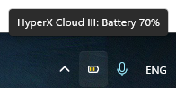

# HyperX Cloud III Wireless Tray Utility

A small Windows tray **mini-utility** that shows the battery level of **HyperX Cloud III Wireless** headset.  
Built with WinForms and depends on the [HidSharp](https://www.zer7.com/software/hidsharp) library.

## Features
- Displays battery percentage in the system tray
- Lightweight and minimal
- Supports Windows autostart (via registry)

## Screenshot

## Device Information
| Parameter | Value    |                                    |
|-----------|----------|------------------------------------|
| **VID**   | `0x03F0` | HP Inc.                            |
| **PID**   | `0x05B7` | HyperX Cloud III Wireless dongle   |

## HID Reports (RID = 0x66)

| Purpose                        | First byte | Offset of value | Notes                                    |
|--------------------------------|------------|-----------------|------------------------------------------|
| Battery percentage             | `0x89`     | 4               | Byte 4 = battery level (0–100)           |
| Connection / Disconnection     | `0x0D`     | 2               | Byte 1 = connected / disconnected flag   |
| Battery level changed status   | `0x0C`     | 2               |                                          |
| Cable pluggedIn status         | `0x8A`     | 2               |                                          |
| Connection status request      | `0x82`     |	2               |                                          |

## Requirements
- [.NET 8.0 (Windows)](https://dotnet.microsoft.com/)
- [HidSharp](https://www.zer7.com/software/hidsharp)
